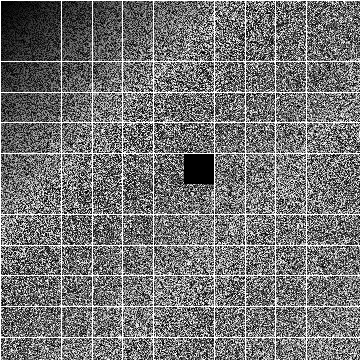

# DEV Challenge Final '2022

## Task
We have preprocessed images of remote scanning, which reflects the probability of the location of mines on the given coordinates.

Format: png, grayscale byte color model without alpha channel.

Image contains:
- x any y  coordinate grid,  which are always white and 1-pixel wide.
- cells, numbering starting from (0,0) at the top left angle.

The probability of mines located in the cell is determined by darkness (i.e. number of dark pixels inside the cell).

<b>Task:</b> Create web API that will take image (png image as base64 DataURI string), process it and return coordinates of mines.

```
POST: http://127.0.0.1:8080/api/image-input

POST body:
{
    "min_level": 75, // integer 0 - 100
    "image": "..." //  png image as base64 DataURI string
}

Response:
{
    "mines": [
        {
            "x": 0, // x coordinate of cell
            "y": 0, // y coordinate of cell
            "level": 94 // integer 0 - 100
        },
        {
            "x": 6, // x coordinate of cell
            "y": 5, // y coordinate of cell
            "level": 100 // integer 0 - 100
        },
        ...
    ]
}
```

<b>Full task description:</b> https://docs.google.com/document/d/1QuUdFZ3fPTpMuq6sk1urZyVMuxt4nTVOD9-z69jk2M4/edit

<b>Example image:</b>
* Image should be passed as base64 DataURI string


## Solution
Web API, based on php backend (Laravel framework) and ImageMagick image processing.
- Controller: <code>app\Http\Controllers\ImageController::class</code>
- ImageHandler Service: <code>app\Services\ImageHandler::class</code>

## Stack
- PHP 8.1
- ImageMagick
- Laravel 9

## How to start service
1. Start Docker container: <code>docker-compose up -d</code>
2. SSH connect to Docker container: <code>docker exec -it devchallenge.final.app bash</code>
3. Install composer dependencies. Run in terminal: <code>composer install</code>
4. Run test in terminal: <code>php artisan test</code>
